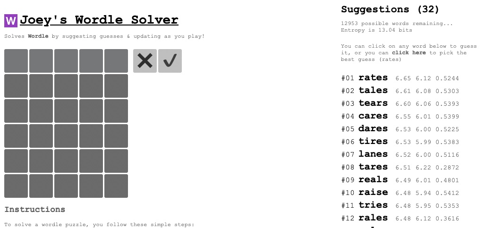

#  Joey's Wordle Solver

This is a [Rust](https://rust-lang.org) + [Yew](https://yew.rs/) [WASM](https://webassembly.org/) 
web-app which implements an interactive [Wordle](https://www.nytimes.com/games/wordle/index.html)
solver, described originally by [Grant Sanderson (3blue1brown)](https://www.youtube.com/c/3blue1brown)'s 
[YouTube video on solving wordle](https://youtu.be/v68zYyaEmEA) with 
[information theory](https://en.wikipedia.org/wiki/Information_theory).

It's running live on my site, at [https://wordle.joey.sh](https://wordle.joey.sh) where you can
try it out. It's best viewed on a desktop, and works in recent versions of all major browsers.

The mathematics are described in code documentation, and the webpage is supposed to be styled like
a notebook & as such also documents the mathematics/methodology.
